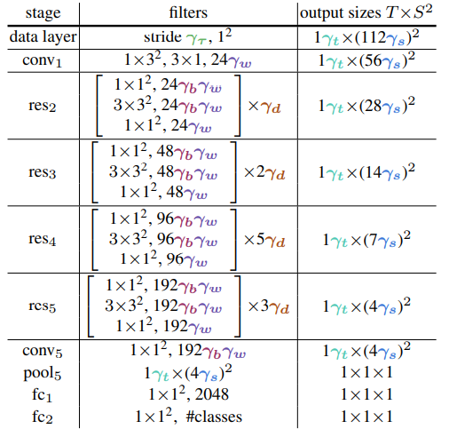
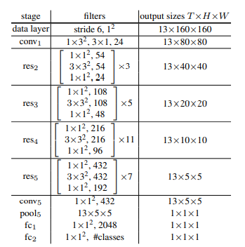
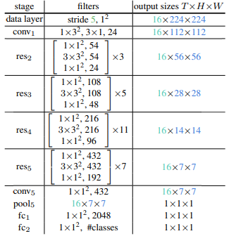

# Contents
- [Contents](#contents)
  - [Description](#description)
  - [Model Architecture](#model-architecture)
  - [Dataset](#dataset)
  - [Environment Requirements](#environment-requirements)
  - [Quick Start](#quick-start)
  - [Script Description](#script-description)
    - [Script and Sample Code](#script-and-sample-code)
    - [Script Parameters](#script-parameters)
  - [Training Process](#training-process)
    - [Training](#training)
    - [Distributed Training](#distributed-training)
  - [Evaluation Process](#evaluation-process)
  - [Model Description](#model-description)
  - [Citation](#citation)

## Description


X3D network progressively expand a 2D network across the following axes: Temporal duration $\gamma_t$, frame rate $\gamma_{\tau}$ , spatial resolution $\gamma_s$, width $\gamma_w$, bottleneck width $\gamma_b$, and depth $\gamma_d$.

- X-Fast expands the temporal activation size, $\gamma_t$, by increasing the frame-rate, $1/\gamma_{\tau}$ , and therefore temporal resolution, while holding the clip duration constant.

- X-Temporal expands the temporal size, $\gamma_t$, by sampling a longer temporal clip and increasing the frame-rate $1/\gamma_{\tau}$ , to expand both duration and temporal resolution.

- X-Spatial expands the spatial resolution, $\gamma_s$, by increasing the spatial sampling resolution of the input video

- X-Depth expands the depth of the network by increasing the number of layers per residual stage by $\gamma_d$ times.

- X-Width uniformly expands the channel number for all layers by a global width expansion factor $\gamma_w$.

- X-Bottleneck expands the inner channel width, $\gamma_b$, of the center convolutional filter in each residual block.

## Model Architecture

The architecture of x3d is as follows:

<div align=center>

</div>

The dimensions of kernels are denoted by $\{{{T×S^2, C}}\}$ for temporal, spatial, and channel sizes. Strides are denoted as {temporal stride, spatial ${stride}^2$}. This network is expanded using factors $\{\gamma_t,\gamma_{\tau},\gamma_s,\gamma_w,\gamma_b,\gamma_d\}$ to form X3D. Without expansion (all factors equal to one), this model is referred to as X2D, having 20.67M FLOPS and 1.63M parameters.

<div align=center>

</div>

X3D-S with 1.96G FLOPs, 3.76M param, and 72.9% top-1 accuracy using expansion of $\gamma_{\tau}=6$, $\gamma_t=13$, $\gamma_s=\sqrt{2}$, $\gamma_w=1$, $\gamma_b=2.25$, $\gamma_d=2.2$.

<div align=center>

</div>

X3D-M with 4.73G FLOPs, 3.76M param, and 74.6% top-1 accuracy using expansion of $\gamma_{\tau}=5$, $\gamma_t=16$, $\gamma_s=2$, $\gamma_w=1$, $\gamma_b=2.25$, $\gamma_d=2.2$.

## Dataset

Dataset used: [Kinetics400](https://www.deepmind.com/open-source/kinetics)

- Description: Kinetics-400 is a commonly used dataset for benchmarks in the video field. For details, please refer to its official website [Kinetics](https://www.deepmind.com/open-source/kinetics). For the download method, please refer to the official address [ActivityNet](https://github.com/activitynet/ActivityNet/tree/master/Crawler/Kinetics), and use the download script provided by it to download the dataset.

- Dataset size：

    |category|Number of data|
    |:---:|:---:|
    |Training set|234619|
    |Validation set|19761|

```text
The directory structure of Kinetic-400 dataset looks like:

    .
    |-kinetic-400
        |-- train
        |   |-- ___qijXy2f0_000011_000021.mp4       // video file
        |   |-- ___dTOdxzXY_000022_000032.mp4       // video file
        |    ...
        |-- test
        |   |-- __Zh0xijkrw_000042_000052.mp4       // video file
        |   |-- __zVSUyXzd8_000070_000080.mp4       // video file
        |-- val
        |   |-- __wsytoYy3Q_000055_000065.mp4       // video file
        |   |-- __vzEs2wzdQ_000026_000036.mp4       // video file
        |    ...
        |-- kinetics-400_train.csv                  // training dataset label file.
        |-- kinetics-400_test.csv                   // testing dataset label file.
        |-- kinetics-400_val.csv                    // validation dataset label file.

        ...
```

## Environment Requirements

- Framework
  - [MindSpore](https://www.mindspore.cn/install/en)

- Requirements
 
```text
Python and dependencies
    - python 3.7.5
    - decord 0.6.0
    - imageio 2.21.1
    - imageio-ffmpeg 0.4.7
    - mindspore-gpu 1.6.1
    - ml-collections 0.1.1
    - matplotlib 3.4.1
    - numpy 1.21.5
    - Pillow 9.0.1
    - PyYAML 6.0
    - scikit-learn 1.0.2
    - scipy 1.7.3
    - pycocotools 2.0
```

- For more information, please check the resources below：
  - [MindSpore Tutorials](https://www.mindspore.cn/tutorials/en/master/index.html)
  - [MindSpore Python API](https://www.mindspore.cn/docs/en/master/index.html)

## Quick Start

- Run on GPU

```text
cd scripts/

# run training example
bash train_standalone.sh [PROJECT_PATH] [DATA_PATH]

# run distributed training example
bash train_distribute.sh [PROJECT_PATH] [DATA_PATH]

# run evaluation example
bash eval_standalone.sh [PROJECT_PATH] [DATA_PATH]
```

## Script Description

### Script and Sample Code

```text
.
│  infer.py                                     // infer script
│  README.md                                    // descriptions about X3D
│  train.py                                     // training script
│
├─scripts
│      eval_standalone.sh                       // shell script for testing on GPU
│      train_distribute.sh                      // shell script for distributed training on GPU
│      train_standalone.sh                      // shell script for training on GPU
│
└─src
    │
    ├─config
    │      x3d_l.yaml                           // X3D-L parameter configuration
    │      x3d_m.yaml                           // X3D-M parameter configuration
    │      x3d_s.yaml                           // X3D-S parameter configuration
    │      x3d_xs.yaml                          // X3D-XS parameter configuration
    │
    ├─data
    │  │  builder.py                            // build data
    │  │  download.py                           // download dataset
    │  │  generator.py                          // generate video dataset
    │  │  images.py                             // process image
    │  │  kinetics400.py                        // kinetics400 dataset
    │  │  kinetics600.py                        // kinetics600 dataset
    │  │  meta.py                               // public API for dataset
    │  │  path.py                               // IO path
    │  │  ucf101.py                             // ucf101 dataset
    │  │  video_dataset.py                      // video dataset
    │  │
    │  └─transforms
    │          builder.py                       // build transforms
    │          video_center_crop.py             // center crop
    │          video_normalize.py               // normalize
    │          video_random_crop.py             // random crop
    │          video_random_horizontal_flip.py  // random horizontal flip
    │          video_reorder.py                 // reorder
    │          video_rescale.py                 // rescale
    │          video_reshape.py                 // reshape
    │          video_resize.py                  // resize
    │          video_short_edge_resize.py       // short edge resize
    │
    ├─example
    │      x3d_kinetics400_eval.py              // eval x3d model
    │      x3d_kinetics400_train.py             // train x3d model
    │
    ├─loss
    │      builder.py                           // build loss
    │
    ├─models
    │  │  builder.py                            // build model
    │  │  x3d.py                                // x3d model
    │  │
    │  └─layers
    │          adaptiveavgpool3d.py             // adaptive average pooling 3D.
    │          avgpool3d.py                     // average pooling 3D
    │          dropout_dense.py                 // dense head
    │          inflate_conv3d.py                // inflate conv3d block
    │          resnet3d.py                      // resnet backbone
    │          squeeze_excite3d.py              // squeeze and excitation
    │          swish.py                         // swish activation function
    │          unit3d.py                        // unit3d module
    │
    ├─optim
    │      builder.py                           // build optimizer
    │
    ├─schedule
    │      builder.py                           // build learning rate shcedule
    │      lr_schedule.py                       // learning rate shcedule
    │
    └─utils
            callbacks.py                        // eval loss monitor
            check_param.py                      // check parameters
            class_factory.py                    // class register
            config.py                           // parameter configuration
            six_padding.py                      // convert padding list into tuple

```

### Script Parameters

- config for x3d-m
  
```text
# model architecture
model_name: X3D                                          

# The dataset sink mode.
dataset_sink_mode: False

# Context settings.
context:
    mode: 0 #0--Graph Mode; 1--Pynative Mode
    device_target: "GPU"

# Model settings.
model:
    type: x3d_m                                     # Type of model
    num_classes: 400                                # Number of classes
    dropout_rate: 0.5                               # Dropout rate
    depth_factor: 2.2
    num_frames: 16                                  # Number of frames
    train_crop_size: 224

learning_rate:
    lr_scheduler: "cosine_annealing"                # Learning rate scheduler
    lr: 0.1                                         # Learning rate
    eta_min: 0.0                                    # Minimum learning rate
    t_max: 300                                      # Cycle of learning rate
    max_epoch: 300                                  # Total number of epochs
    warmup_epochs: 35                               # Number of warmup epochs

optimizer:
    type: 'SGD'                                     # Optimizer function
    momentum: 0.9                                   # Momentum value in optimizer
    weight_decay: 0.00005                           # Weight decay

loss:
    type: SoftmaxCrossEntropyWithLogits             # Loss function
    sparse: True
    reduction: "mean"

train:
    pre_trained: False                              # Whether load pretrained model
    pretrained_model: ""                            # Location of pretrained model
    ckpt_path: "./output/"                          # Ckpt save path
    epochs: 100                                     # Total number of epochs
    save_checkpoint_epochs: 5
    save_checkpoint_steps: 1875
    keep_checkpoint_max: 10                         # Max ckpt file number
    run_distribute: False                           # Whether run distribute

infer:
    pretrained_model: "x3d_m_kinetics400.ckpt"

# kinetic dataset config
data_loader:
    train:
        dataset:
              type: Kinetic400                      # Type of dataset
              path: "/home/publicfile/kinetics-400" # Root directory of dataset
              split: 'train'        
              seq: 16                               # The number of frames of captured video
              seq_mode: 'interval'                  # The way of capture video frames
              num_parallel_workers: 8               # Number of CPU worker used to load data
              shuffle: True
              batch_size: 16                        # Numbers of videos in a mini-batch
              repeat_num: 1
              frame_interval: 5                     # Frame interval of the sample strategy

        map:
            operations:
                - type: VideoShortEdgeResize
                  size: 256
                - type: VideoRandomCrop
                  size: [224, 224]
                - type: VideoRandomHorizontalFlip
                  prob: 0.5
                - type: VideoRescale
                  shift: 0
                - type: VideoReOrder
                  order: [3, 0, 1, 2]
                - type: VideoNormalize
                  mean: [0.45, 0.45, 0.45]
                  std: [0.225, 0.225, 0.225]
            input_columns: ["video"]

    eval:
        dataset:
            type: Kinetic400
            path: "/home/publicfile/kinetics-400"
            split: 'val'
            seq: 16
            seq_mode: 'interval'
            num_parallel_workers: 4
            shuffle: False
            batch_size: 8
            repeat_num: 1
            frame_interval: 5
        map:
            operations:
                - type: VideoShortEdgeResize
                  size: 256
                - type: VideoCenterCrop
                  size: [256, 256]
                - type: VideoRescale
                  shift: 0
                - type: VideoReOrder
                  order: [3, 0, 1, 2]
                - type: VideoNormalize
                  mean: [0.45, 0.45, 0.45]
                  std: [0.225, 0.225, 0.225]
            input_columns: ["video"]
    group_size: 1

```

## Training Process

### Training

Run `scripts/train_standalone.sh` to train the model(x3d_m) standalone. The usage of the script is:

```text
bash train_standalone.sh [PROJECT_PATH] [DATA_PATH]
```

You can view the results through the file `train_standalone.log`.

```text
[Start training `x3d_kinetics400`]
================================================================================
epoch: 1 step: 1, loss is 5.995155334472656
epoch: 1 step: 2, loss is 6.002779483795166
epoch: 1 step: 3, loss is 5.9802398681640625
epoch: 1 step: 4, loss is 5.989277362823486
epoch: 1 step: 5, loss is 5.979276180267334
epoch: 1 step: 6, loss is 5.996688365936279
epoch: 1 step: 7, loss is 5.987305641174316
...
```

The model checkpoint will be saved into `./x3d`.

### Distributed Training

Run 'scripts/train_distribute.sh' to train the model distributed. The usage of the script is:

```text
bash train_distribute.sh [PROJECT_PATH] [DATA_PATH]
```

The above shell script will run distribute training in the background. You can view the results through the file `train_distributed.log`.

```text
[Start training `x3d_kinetics400`]
================================================================================
epoch: 1 step: 1, loss is 5.988784313201904
epoch: 1 step: 1, loss is 5.9909162521362305
epoch: 1 step: 2, loss is 5.995461463928223
epoch: 1 step: 2, loss is 5.985698223114014
epoch: 1 step: 3, loss is 5.979603290557861
epoch: 1 step: 3, loss is 5.984967231750488
epoch: 1 step: 4, loss is 5.994110584259033
epoch: 1 step: 4, loss is 5.9942779541015625
epoch: 1 step: 5, loss is 6.005364894866943
epoch: 1 step: 5, loss is 5.98798942565918
epoch: 1 step: 6, loss is 5.977146148681641
epoch: 1 step: 6, loss is 6.000572204589844
epoch: 1 step: 7, loss is 5.988678932189941
epoch: 1 step: 7, loss is 5.995543003082275
```

The model checkpoint will be saved into `./x3dckpt`.

## Evaluation Process

The evaluation dataset was [Kinetics400](https://www.deepmind.com/open-source/kinetics)

Run `scripts/eval_standalone.sh` to evaluate the model(x3d_m). The usage of the script is:

```text
bash scripts/eval_standalone.sh [PROJECT_PATH] [DATA_PATH] [MODEL_PATH]
```

The eval results can be viewed in `eval_result.log`.

```text
[Start eval `x3d_kinetics400`]
eval: 1/2484
eval: 2/2484
eval: 3/2484
eval: 4/2484
...
eval: 2482/2484
eval: 2483/2484
eval: 2484/2484
{'Loss':5.988906774751, 'Top_1_Accuracy': 0.7455716586151369, 'Top_5_Accuracy': 0.919987922705314}
```

## Model Description

| Parameters          | X3D-XS | X3D-S | X3D-M | X3D-L |
| :-----------------: | :---: | :---: | :---: | :---: |
| SIZE                | XS | S | M | L |
| Dataset             | Kinetics 400 | Kinetics 400  | Kinetics 400  | Kinetics 400  |
| parameters (M)      | 3.8                | 3.8         | 3.8 | 6.2 |
| FLOPs (G)           | 0.60 | 1.96 | 4.73 | 18.37 |
| Top1 10-clip        | 67.04 | 71.54 | 74.56 | 75.21 |
| Top5 10-clip        | 87.88 | 90.71 | 92.00 | 92.42 |
| Frame length        | 4 | 13 | 16 | 16 |
| Sample rate         | 12  | 6 | 5 | 5 |
| Batch_size          | 16 | 16 | 16 | 8 |
| Training Parameters | train_crop_size = 160, depth_factor = 2.2 | train_crop_size = 160, depth_factor = 2.2 |  train_crop_size = 224, depth_factor = 2.2 | train_crop_size = 312, depth_factor = 5.0 |
| Optimizer           | SGD | SGD | SGD | SGD |
| Scheduler           | cosine_annealing | cosine_annealing | cosine_annealing | cosine_annealing |
| Loss Function       | SoftmaxCrossEntropyWithLogits | SoftmaxCrossEntropyWithLogits | SoftmaxCrossEntropyWithLogits | SoftmaxCrossEntropyWithLogits |
| Config               | [src/config/x3d_XS](src/config/x3d_xs.yaml) | [src/config/x3d_S](src/config/x3d_s.yaml) | [src/config/x3d_M](src/config/x3d_m.yaml) | [src/config/x3d_L](src/config/x3d_l.yaml) |
| Pretrained Model     | [x3d_XS_kinetics400.ckpt](https://zjuteducn-my.sharepoint.com/:u:/g/personal/201906010313_zjut_edu_cn/EYwLbhrIcCdIor3J_Dxj3foBMx2bFb7zcw9QRVBkamZE_A?e=p4tDBt) | [x3d_S_kinetics400.ckpt](https://zjuteducn-my.sharepoint.com/:u:/g/personal/201906010313_zjut_edu_cn/EUH1YqWCkLlLlEMA9A8MuwQBSPQ0yjyUJVUIlsuWbP3YeQ?e=WK955U) | [x3d_M_kinetics400.ckpt](https://zjuteducn-my.sharepoint.com/:u:/g/personal/201906010313_zjut_edu_cn/EVqLWmg7v4JBkLJPY3vP-1kBeq7uI5sE2Tin7kM5PcxQMw?e=S1wCy0) | [x3d_L_kinetics400.ckpt](https://zjuteducn-my.sharepoint.com/:u:/g/personal/201906010313_zjut_edu_cn/EaVbGiHvrf5Nl6TooLlq340B4LMrLF8Cqm9PH0w9Mlqx9Q?e=a2XEoh) |


## Citation

If you find this project useful in your research, please consider citing:

```latex
@inproceedings{x3d2020,
  Author    = {Christoph Feichtenhofer},
  Title     = {{X3D}: Progressive Network Expansion for Efficient Video Recognition},
  Booktitle = {{CVPR}},
  Year      = {2020}},
  doi       = {10.1109/cvpr42600.2020.00028},
```

```latex
@misc{x3d_mindspore,
    title={Mindspore Video Models},
    author={ZJUT-ERCISS},
    year={2022},
    publisher = {GitHub},
    journal = {GitHub repository},
    howpublished = {\url{https://github.com/ZJUT-ERCISS/x3d_misdspore}}
}
```
